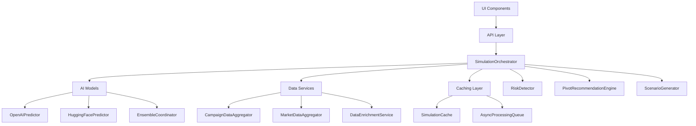
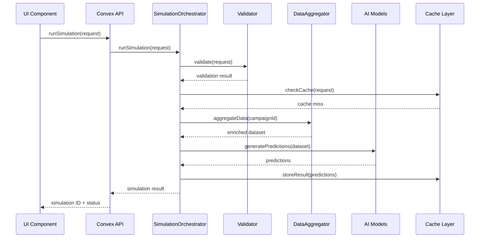
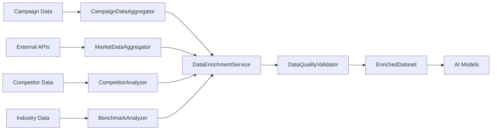

# Design Document

## Overview

This design outlines the integration of the comprehensive AI trajectory simulation infrastructure into the existing campaign management application. The system includes multiple AI predictors, data aggregators, orchestration services, and UI components that need to be properly wired together to provide a seamless user experience.

The integration follows a layered architecture approach where AI services are abstracted behind well-defined interfaces, allowing for easy testing, maintenance, and future enhancements.

## Architecture

### High-Level Architecture



### Service Integration Layers

1. **Presentation Layer**: React components for simulation UI
2. **API Layer**: Convex mutations and queries for data operations
3. **Orchestration Layer**: SimulationOrchestrator coordinates all services
4. **AI Model Layer**: Multiple predictors with ensemble coordination
5. **Data Layer**: Aggregation and enrichment services
6. **Caching Layer**: Performance optimization and queue management
7. **Analysis Layer**: Risk detection and recommendation generation

## Components and Interfaces

### 1. Campaign Page Integration

**Location**: `src/app/(main)/campaigns/[id]/page.tsx`

**Integration Points**:
- Replace placeholder simulation components with actual implementations
- Wire SimulationTrigger to use SimulationOrchestrator
- Connect SimulationHistory to display real simulation results
- Integrate real-time status updates

**Key Changes**:
```typescript
// Import actual simulation services
import { SimulationOrchestrator } from '@/lib/simulation/orchestration/SimulationOrchestrator';
import { SimulationRequestForm } from '@/components/simulations/SimulationRequestForm';
import { SimulationResults } from '@/components/simulations/SimulationResults';

// Replace mock data with real service calls
const handleRunSimulation = async (request: SimulationRequest) => {
  const orchestrator = new SimulationOrchestrator();
  return await orchestrator.runSimulation(request);
};
```

### 2. Dashboard AI Insights Integration

**Location**: `src/app/(main)/dashboard/page.tsx`

**Integration Points**:
- Replace mock performance data with real AI predictions
- Add risk alerts from RiskDetector
- Show pivot recommendations from PivotRecommendationEngine
- Display real-time simulation status across campaigns

**Key Changes**:
```typescript
// Add AI-powered insights
import { RiskDetector } from '@/lib/simulation/orchestration/RiskDetector';
import { PivotRecommendationEngine } from '@/lib/simulation/orchestration/PivotRecommendationEngine';

// Replace mock insights with real AI analysis
const generateAIInsights = async (campaigns: Campaign[]) => {
  const riskDetector = new RiskDetector();
  const recommendationEngine = new PivotRecommendationEngine();
  
  // Generate insights for each campaign
  return await Promise.all(campaigns.map(async (campaign) => {
    const risks = await riskDetector.detectRisks(campaign.data);
    const recommendations = await recommendationEngine.generateRecommendations(campaign.data);
    return { campaign, risks, recommendations };
  }));
};
```

### 3. Simulation Components Integration

**Location**: `src/components/simulations/`

**Integration Points**:
- Wire SimulationRequestForm to use actual validation services
- Connect SimulationResults to display real prediction data
- Integrate SimulationStatus with real-time updates from Convex
- Add error handling using SimulationErrorHandler

**Key Components to Update**:

#### SimulationRequestForm
```typescript
import { SimulationRequestValidator } from '@/lib/simulation/validation';
import { DataQualityValidator } from '@/lib/simulation/validation';

const validator = new SimulationRequestValidator();
const dataQualityValidator = new DataQualityValidator();

// Add real validation logic
const validateRequest = async (request: SimulationRequest) => {
  const validation = await validator.validate(request);
  const dataQuality = await dataQualityValidator.validateCampaignData(campaignData);
  return { validation, dataQuality };
};
```

#### SimulationResults
```typescript
import { PredictedVsActualChart } from './PredictedVsActualChart';
import { RiskAlerts } from './RiskAlerts';
import { PivotRecommendations } from './PivotRecommendations';

// Display real results with proper error handling
const SimulationResults = ({ simulation }: { simulation: SimulationResult }) => {
  return (
    <div>
      <PredictedVsActualChart trajectories={simulation.trajectories} />
      <RiskAlerts risks={simulation.risks} />
      <PivotRecommendations recommendations={simulation.recommendations} />
    </div>
  );
};
```

### 4. Convex API Integration

**Location**: `convex/simulations.ts`

**Integration Points**:
- Create mutations for simulation requests
- Add queries for real-time status updates
- Implement caching logic using SimulationCache
- Add queue management using AsyncProcessingQueue

**Key Functions**:
```typescript
// Mutation to start simulation
export const runSimulation = mutation({
  args: {
    campaignId: v.id("campaigns"),
    config: v.object({
      timeframe: v.object({
        startDate: v.number(),
        endDate: v.number(),
        granularity: v.union(v.literal("daily"), v.literal("weekly")),
      }),
      metrics: v.array(v.object({
        type: v.string(),
        weight: v.number(),
      })),
      scenarios: v.array(v.string()),
    }),
  },
  handler: async (ctx, args) => {
    // Use SimulationOrchestrator to process request
    const orchestrator = new SimulationOrchestrator();
    const result = await orchestrator.runSimulation({
      campaignId: args.campaignId,
      ...args.config,
    });
    
    // Store result in database
    return await ctx.db.insert("simulations", {
      campaignId: args.campaignId,
      config: args.config,
      status: result.status,
      results: result,
      createdAt: Date.now(),
    });
  },
});

// Query for real-time status
export const getSimulationStatus = query({
  args: { simulationId: v.id("simulations") },
  handler: async (ctx, args) => {
    const simulation = await ctx.db.get(args.simulationId);
    if (!simulation) return null;
    
    // Check with orchestrator for real-time status
    const orchestrator = new SimulationOrchestrator();
    const status = await orchestrator.getSimulationStatus(simulation._id);
    
    return { ...simulation, currentStatus: status };
  },
});
```

## Data Models

### Enhanced Simulation Request Flow



### Data Enrichment Pipeline



## Error Handling

### Error Recovery Strategy

```typescript
// Implement comprehensive error handling
export class IntegratedErrorHandler {
  private simulationErrorHandler: SimulationErrorHandler;
  private retryManager: RetryManager;
  
  constructor() {
    this.simulationErrorHandler = new SimulationErrorHandler();
    this.retryManager = new RetryManager();
  }
  
  async handleSimulationError(error: Error, context: SimulationContext): Promise<SimulationResult> {
    // Log error with context
    await this.simulationErrorHandler.handleError(error, context);
    
    // Attempt recovery strategies
    if (error instanceof ModelAPIError) {
      return await this.handleModelFailure(context);
    }
    
    if (error instanceof InsufficientDataError) {
      return await this.handleDataIssues(context);
    }
    
    // Fallback to degraded service
    return await this.provideFallbackResult(context);
  }
  
  private async handleModelFailure(context: SimulationContext): Promise<SimulationResult> {
    // Use ensemble coordinator to switch to backup models
    const ensemble = new EnsembleCoordinator(fallbackConfig);
    return await ensemble.generateFallbackPrediction(context);
  }
}
```

## Testing Strategy

### Unit Testing Approach

1. **Service Layer Testing**:
   - Mock external API calls
   - Test error handling scenarios
   - Validate data transformation logic

2. **Integration Testing**:
   - Test service coordination
   - Validate end-to-end simulation flow
   - Test caching behavior

3. **Component Testing**:
   - Test UI component integration
   - Validate real-time updates
   - Test error state handling

### Test Structure

```typescript
// Example test for SimulationOrchestrator integration
describe('SimulationOrchestrator Integration', () => {
  let orchestrator: SimulationOrchestrator;
  let mockCampaignData: CampaignDataset;
  
  beforeEach(() => {
    orchestrator = new SimulationOrchestrator();
    mockCampaignData = createMockCampaignData();
  });
  
  it('should coordinate all services for complete simulation', async () => {
    const request = createSimulationRequest();
    const result = await orchestrator.runSimulation(request);
    
    expect(result.status).toBe('completed');
    expect(result.trajectories).toBeDefined();
    expect(result.risks).toBeDefined();
    expect(result.recommendations).toBeDefined();
  });
  
  it('should handle model failures gracefully', async () => {
    // Mock model failure
    jest.spyOn(OpenAIPredictor.prototype, 'predict').mockRejectedValue(new ModelAPIError('API timeout'));
    
    const request = createSimulationRequest();
    const result = await orchestrator.runSimulation(request);
    
    // Should fallback to other models
    expect(result.status).toBe('completed');
    expect(result.modelMetadata.model_name).not.toBe('openai-gpt4o');
  });
});
```

### Performance Testing

1. **Load Testing**:
   - Test concurrent simulation requests
   - Validate queue management
   - Test cache performance

2. **Memory Testing**:
   - Monitor memory usage during large simulations
   - Test garbage collection behavior
   - Validate cache cleanup

3. **API Testing**:
   - Test external API rate limiting
   - Validate retry mechanisms
   - Test timeout handling

## Implementation Phases

### Phase 1: Core Service Integration
- Integrate SimulationOrchestrator with Convex API
- Wire basic AI models (OpenAI, HuggingFace)
- Implement basic error handling

### Phase 2: Data Pipeline Integration
- Integrate data aggregation services
- Add external data source connections
- Implement caching layer

### Phase 3: Advanced Features Integration
- Add ensemble coordination
- Integrate risk detection and recommendations
- Implement performance tracking

### Phase 4: UI Integration
- Wire all simulation components
- Add real-time status updates
- Implement comprehensive error handling in UI

### Phase 5: Optimization and Monitoring
- Add performance monitoring
- Implement A/B testing for models
- Add comprehensive logging and analytics

## Security Considerations

### API Key Management
- Use APIKeyManager for secure key storage
- Implement key rotation mechanisms
- Add audit logging for key usage

### Data Privacy
- Encrypt sensitive simulation data
- Implement data retention policies
- Add user consent management

### Access Control
- Validate user permissions for simulations
- Implement organization-level access controls
- Add audit trails for simulation requests

## Monitoring and Observability

### Metrics to Track
- Simulation success/failure rates
- Model performance accuracy
- API response times
- Cache hit rates
- Queue processing times

### Alerting Strategy
- Model performance degradation alerts
- API failure notifications
- Queue backup alerts
- Data quality warnings

### Logging Strategy
- Structured logging for all services
- Error correlation across services
- Performance metrics logging
- User action tracking