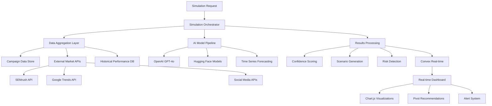
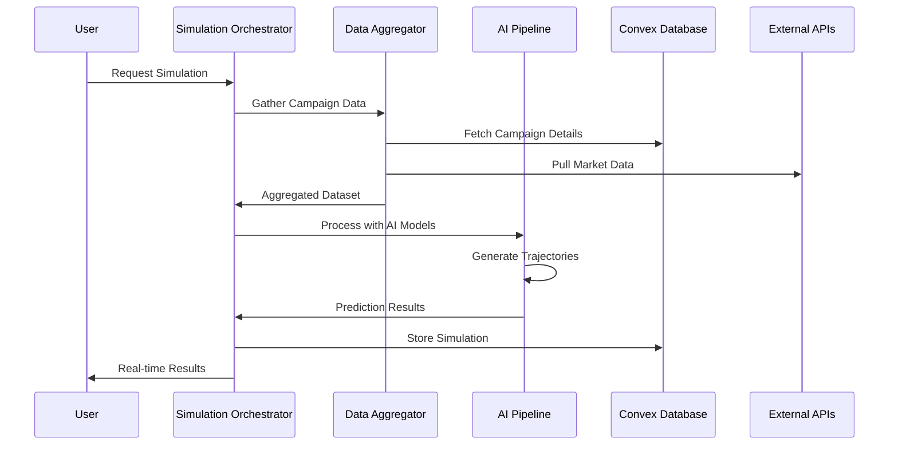

# AI Trajectory Simulation Engine Design Document

## Overview

The AI Trajectory Simulation Engine transforms PivotPulse from a campaign management tool into an intelligent predictive analytics platform. This system leverages multiple AI models to generate probabilistic performance trajectories for ad campaigns, providing users with actionable insights about future performance, risk identification, and optimization opportunities. The engine integrates seamlessly with existing campaign data and external market intelligence to deliver comprehensive simulation capabilities.

## Architecture

### High-Level Architecture



### Data Flow Architecture



## Components and Interfaces

### Core Simulation Components

#### 1. Simulation Orchestrator (`SimulationOrchestrator`)

```typescript
interface SimulationRequest {
  campaignId: string;
  timeframe: {
    startDate: Date;
    endDate: Date;
    granularity: 'daily' | 'weekly';
  };
  metrics: SimulationMetric[];
  scenarios: ScenarioConfig[];
  externalDataSources: ExternalDataSource[];
}

interface SimulationMetric {
  type: 'ctr' | 'impressions' | 'engagement' | 'reach' | 'conversions' | 'cpc' | 'cpm';
  weight: number;
  benchmarkSource?: 'industry' | 'historical' | 'competitor';
}

class SimulationOrchestrator {
  async runSimulation(request: SimulationRequest): Promise<SimulationResult>;
  async getSimulationStatus(simulationId: string): Promise<SimulationStatus>;
  async cancelSimulation(simulationId: string): Promise<void>;
}
```

#### 2. Data Aggregation Layer (`DataAggregator`)

```typescript
interface CampaignDataset {
  campaign: CampaignData;
  historicalPerformance: PerformanceMetric[];
  audienceInsights: AudienceData;
  creativeAssets: CreativeData[];
  budgetAllocation: BudgetData;
}

interface MarketDataset {
  competitorActivity: CompetitorMetric[];
  seasonalTrends: TrendData[];
  industryBenchmarks: BenchmarkData[];
  marketVolatility: VolatilityIndex;
}

class DataAggregator {
  async aggregateCampaignData(campaignId: string): Promise<CampaignDataset>;
  async fetchMarketData(context: MarketContext): Promise<MarketDataset>;
  async enrichWithExternalData(dataset: CampaignDataset): Promise<EnrichedDataset>;
}
```

#### 3. AI Model Pipeline (`AIModelPipeline`)

```typescript
interface ModelConfig {
  primary: 'openai-gpt4o' | 'huggingface-prophet' | 'custom-lstm';
  fallback: string[];
  confidence_threshold: number;
  ensemble_weights: Record<string, number>;
}

interface PredictionOutput {
  trajectories: TrajectoryPoint[];
  confidence_intervals: ConfidenceInterval[];
  feature_importance: FeatureImportance[];
  model_metadata: ModelMetadata;
}

class AIModelPipeline {
  async generateTrajectories(dataset: EnrichedDataset, config: ModelConfig): Promise<PredictionOutput>;
  async validatePredictions(output: PredictionOutput): Promise<ValidationResult>;
  async explainPredictions(output: PredictionOutput): Promise<ExplanationResult>;
}
```

### AI Model Implementations

#### 1. OpenAI GPT-4o Integration (`OpenAIPredictor`)

```typescript
class OpenAIPredictor implements AIPredictor {
  private async buildPrompt(dataset: EnrichedDataset): Promise<string> {
    return `
    Analyze this campaign data and predict performance trajectories:
    
    Campaign: ${dataset.campaign.name}
    Budget: ${dataset.campaign.budget}
    Duration: ${dataset.campaign.duration} days
    Audience: ${dataset.audience.size} people
    Channels: ${dataset.channels.join(', ')}
    
    Historical Performance:
    ${this.formatHistoricalData(dataset.historicalPerformance)}
    
    Market Context:
    ${this.formatMarketData(dataset.marketData)}
    
    Generate probabilistic trajectories for CTR, impressions, and engagement over ${dataset.timeframe} with confidence intervals.
    `;
  }
  
  async predict(dataset: EnrichedDataset): Promise<PredictionOutput> {
    const prompt = await this.buildPrompt(dataset);
    const response = await this.openai.chat.completions.create({
      model: "gpt-4o",
      messages: [{ role: "user", content: prompt }],
      temperature: 0.3,
      response_format: { type: "json_object" }
    });
    
    return this.parseGPTResponse(response);
  }
}
```

#### 2. Hugging Face Time Series Models (`HuggingFacePredictor`)

```typescript
class HuggingFacePredictor implements AIPredictor {
  private models = {
    prophet: 'facebook/prophet',
    lstm: 'huggingface/time-series-transformer',
    sentiment: 'cardiffnlp/twitter-roberta-base-sentiment-latest'
  };
  
  async predict(dataset: EnrichedDataset): Promise<PredictionOutput> {
    // Use Prophet for time series forecasting
    const prophetData = this.prepareTimeSeriesData(dataset);
    const forecast = await this.callHuggingFaceAPI('prophet', prophetData);
    
    // Use sentiment analysis for creative performance
    const sentimentData = this.prepareCreativeData(dataset);
    const sentiment = await this.callHuggingFaceAPI('sentiment', sentimentData);
    
    return this.combineModelOutputs(forecast, sentiment);
  }
}
```

#### 3. Ensemble Model Coordinator (`EnsembleCoordinator`)

```typescript
class EnsembleCoordinator {
  async combineModels(predictions: PredictionOutput[]): Promise<PredictionOutput> {
    const weights = this.calculateDynamicWeights(predictions);
    const ensembleTrajectory = this.weightedAverage(predictions, weights);
    const ensembleConfidence = this.calculateEnsembleConfidence(predictions, weights);
    
    return {
      trajectories: ensembleTrajectory,
      confidence_intervals: ensembleConfidence,
      feature_importance: this.aggregateFeatureImportance(predictions),
      model_metadata: this.createEnsembleMetadata(predictions, weights)
    };
  }
}
```

### Simulation Results Processing

#### 1. Scenario Generator (`ScenarioGenerator`)

```typescript
interface ScenarioConfig {
  type: 'optimistic' | 'realistic' | 'pessimistic' | 'custom';
  percentile?: number;
  adjustments?: ScenarioAdjustment[];
}

interface ScenarioAdjustment {
  factor: 'budget' | 'competition' | 'seasonality' | 'creative_fatigue';
  multiplier: number;
  timeframe?: DateRange;
}

class ScenarioGenerator {
  async generateScenarios(baseTrajectory: TrajectoryPoint[], config: ScenarioConfig[]): Promise<ScenarioResult[]> {
    return Promise.all(config.map(async (scenario) => {
      const adjustedTrajectory = await this.applyScenarioAdjustments(baseTrajectory, scenario);
      const probability = this.calculateScenarioProbability(scenario, baseTrajectory);
      
      return {
        type: scenario.type,
        trajectory: adjustedTrajectory,
        probability,
        key_factors: this.identifyKeyFactors(scenario, adjustedTrajectory)
      };
    }));
  }
}
```

#### 2. Risk Detection Engine (`RiskDetector`)

```typescript
interface RiskAlert {
  type: 'performance_dip' | 'budget_overrun' | 'audience_fatigue' | 'competitor_threat';
  severity: 'low' | 'medium' | 'high' | 'critical';
  probability: number;
  impact: number;
  timeframe: DateRange;
  description: string;
  recommendations: string[];
}

class RiskDetector {
  async detectRisks(trajectory: TrajectoryPoint[], context: MarketDataset): Promise<RiskAlert[]> {
    const risks: RiskAlert[] = [];
    
    // Detect performance dips
    const performanceDips = this.detectPerformanceDips(trajectory);
    risks.push(...performanceDips);
    
    // Detect competitive threats
    const competitorThreats = this.detectCompetitorThreats(context.competitorActivity);
    risks.push(...competitorThreats);
    
    // Detect audience fatigue
    const audienceFatigue = this.detectAudienceFatigue(trajectory);
    risks.push(...audienceFatigue);
    
    return this.prioritizeRisks(risks);
  }
}
```

#### 3. Pivot Recommendation Engine (`PivotRecommendationEngine`)

```typescript
interface PivotRecommendation {
  id: string;
  type: 'budget_reallocation' | 'creative_refresh' | 'audience_expansion' | 'channel_shift' | 'timing_adjustment';
  priority: number;
  impact_estimate: {
    metric: string;
    improvement: number;
    confidence: number;
  };
  implementation: {
    description: string;
    steps: string[];
    effort: 'low' | 'medium' | 'high';
    timeline: string;
  };
  simulation_preview?: TrajectoryPoint[];
}

class PivotRecommendationEngine {
  async generateRecommendations(
    currentTrajectory: TrajectoryPoint[],
    risks: RiskAlert[],
    campaignData: CampaignDataset
  ): Promise<PivotRecommendation[]> {
    const recommendations: PivotRecommendation[] = [];
    
    // Generate budget optimization recommendations
    const budgetRecs = await this.generateBudgetRecommendations(currentTrajectory, campaignData);
    recommendations.push(...budgetRecs);
    
    // Generate creative optimization recommendations
    const creativeRecs = await this.generateCreativeRecommendations(risks, campaignData);
    recommendations.push(...creativeRecs);
    
    // Generate audience optimization recommendations
    const audienceRecs = await this.generateAudienceRecommendations(currentTrajectory, campaignData);
    recommendations.push(...audienceRecs);
    
    return this.rankRecommendations(recommendations);
  }
}
```

## Data Models

### Convex Schema Extensions

```typescript
// simulations table
export const simulations = defineTable({
  campaignId: v.id("campaigns"),
  organizationId: v.id("organizations"),
  createdBy: v.id("users"),
  
  // Simulation Configuration
  config: v.object({
    timeframe: v.object({
      startDate: v.number(),
      endDate: v.number(),
      granularity: v.union(v.literal("daily"), v.literal("weekly")),
    }),
    metrics: v.array(v.object({
      type: v.string(),
      weight: v.number(),
      benchmarkSource: v.optional(v.string()),
    })),
    scenarios: v.array(v.string()),
    externalDataSources: v.array(v.string()),
  }),
  
  // Simulation Status
  status: v.union(
    v.literal("queued"),
    v.literal("processing"),
    v.literal("completed"),
    v.literal("failed"),
    v.literal("cancelled")
  ),
  
  // Results
  results: v.optional(v.object({
    trajectories: v.array(v.object({
      date: v.number(),
      metrics: v.record(v.string(), v.number()),
      confidence: v.number(),
    })),
    
    scenarios: v.array(v.object({
      type: v.string(),
      probability: v.number(),
      trajectory: v.array(v.object({
        date: v.number(),
        metrics: v.record(v.string(), v.number()),
      })),
    })),
    
    risks: v.array(v.object({
      type: v.string(),
      severity: v.string(),
      probability: v.number(),
      description: v.string(),
      timeframe: v.object({
        start: v.number(),
        end: v.number(),
      }),
    })),
    
    recommendations: v.array(v.object({
      id: v.string(),
      type: v.string(),
      priority: v.number(),
      impact_estimate: v.object({
        metric: v.string(),
        improvement: v.number(),
        confidence: v.number(),
      }),
      implementation: v.object({
        description: v.string(),
        steps: v.array(v.string()),
        effort: v.string(),
        timeline: v.string(),
      }),
    })),
  })),
  
  // Model Metadata
  modelMetadata: v.optional(v.object({
    primaryModel: v.string(),
    modelVersions: v.record(v.string(), v.string()),
    processingTime: v.number(),
    dataQuality: v.object({
      completeness: v.number(),
      accuracy: v.number(),
      freshness: v.number(),
    }),
  })),
  
  // Timestamps
  createdAt: v.number(),
  updatedAt: v.number(),
  completedAt: v.optional(v.number()),
})
.index("by_campaign", ["campaignId"])
.index("by_organization", ["organizationId"])
.index("by_status", ["status"])
.index("by_created_at", ["createdAt"]);

// simulation_cache table (for performance optimization)
export const simulationCache = defineTable({
  cacheKey: v.string(), // Hash of input parameters
  campaignId: v.id("campaigns"),
  results: v.any(),
  expiresAt: v.number(),
  createdAt: v.number(),
})
.index("by_cache_key", ["cacheKey"])
.index("by_expiry", ["expiresAt"]);

// external_data_sources table
export const externalDataSources = defineTable({
  organizationId: v.id("organizations"),
  source: v.string(), // 'semrush', 'google_trends', 'twitter_api', etc.
  
  config: v.object({
    apiKey: v.string(), // Encrypted
    endpoint: v.string(),
    rateLimit: v.object({
      requests: v.number(),
      period: v.number(),
    }),
    enabled: v.boolean(),
  }),
  
  lastSync: v.optional(v.number()),
  status: v.union(v.literal("active"), v.literal("error"), v.literal("disabled")),
  
  createdAt: v.number(),
  updatedAt: v.number(),
})
.index("by_organization", ["organizationId"])
.index("by_source", ["source"]);

// market_data_cache table
export const marketDataCache = defineTable({
  source: v.string(),
  dataType: v.string(), // 'competitor_metrics', 'trend_data', 'benchmarks'
  context: v.string(), // Hash of query parameters
  
  data: v.any(),
  
  expiresAt: v.number(),
  createdAt: v.number(),
})
.index("by_source_type", ["source", "dataType"])
.index("by_expiry", ["expiresAt"]);
```

### External API Integration Models

```typescript
// SEMrush API Integration
interface SEMrushCompetitorData {
  domain: string;
  traffic: {
    organic: number;
    paid: number;
    total: number;
  };
  keywords: {
    organic_count: number;
    paid_count: number;
    top_keywords: string[];
  };
  ad_spend_estimate: number;
  market_share: number;
}

// Google Trends API Integration
interface GoogleTrendsData {
  keyword: string;
  timeframe: string;
  geo: string;
  interest_over_time: Array<{
    date: string;
    value: number;
  }>;
  related_queries: string[];
  rising_queries: string[];
}

// Social Media API Integration
interface SocialMediaMetrics {
  platform: 'twitter' | 'facebook' | 'instagram' | 'linkedin';
  metrics: {
    mentions: number;
    sentiment_score: number;
    engagement_rate: number;
    reach: number;
    impressions: number;
  };
  trending_topics: string[];
  competitor_activity: Array<{
    competitor: string;
    activity_score: number;
    content_themes: string[];
  }>;
}
```

## Error Handling

### Model Failure Recovery

```typescript
class ModelFailureHandler {
  async handleModelFailure(error: ModelError, context: SimulationContext): Promise<FallbackResult> {
    switch (error.type) {
      case 'api_timeout':
        return this.retryWithExponentialBackoff(context);
      
      case 'model_unavailable':
        return this.switchToFallbackModel(context);
      
      case 'insufficient_data':
        return this.generateBasicProjection(context);
      
      case 'rate_limit_exceeded':
        return this.queueForLaterProcessing(context);
      
      default:
        return this.generateErrorResponse(error, context);
    }
  }
}
```

### Data Quality Validation

```typescript
class DataQualityValidator {
  async validateDataset(dataset: EnrichedDataset): Promise<ValidationResult> {
    const validations = [
      this.validateCompleteness(dataset),
      this.validateAccuracy(dataset),
      this.validateFreshness(dataset),
      this.validateConsistency(dataset)
    ];
    
    const results = await Promise.all(validations);
    return this.aggregateValidationResults(results);
  }
  
  private async validateCompleteness(dataset: EnrichedDataset): Promise<ValidationCheck> {
    const requiredFields = ['campaign', 'historicalPerformance', 'audienceInsights'];
    const missingFields = requiredFields.filter(field => !dataset[field]);
    
    return {
      type: 'completeness',
      passed: missingFields.length === 0,
      score: (requiredFields.length - missingFields.length) / requiredFields.length,
      issues: missingFields.map(field => `Missing required field: ${field}`)
    };
  }
}
```

## Testing Strategy

### AI Model Testing

```typescript
// Model accuracy testing
describe('AI Model Pipeline', () => {
  test('should generate trajectories within expected confidence intervals', async () => {
    const testDataset = createMockDataset();
    const pipeline = new AIModelPipeline();
    
    const result = await pipeline.generateTrajectories(testDataset, defaultConfig);
    
    expect(result.trajectories).toHaveLength(30); // 30 days
    expect(result.confidence_intervals.every(ci => ci.lower <= ci.upper)).toBe(true);
    expect(result.model_metadata.confidence_score).toBeGreaterThan(0.7);
  });
  
  test('should handle missing data gracefully', async () => {
    const incompleteDataset = createIncompleteDataset();
    const pipeline = new AIModelPipeline();
    
    const result = await pipeline.generateTrajectories(incompleteDataset, defaultConfig);
    
    expect(result.model_metadata.data_quality.completeness).toBeLessThan(1.0);
    expect(result.trajectories).toBeDefined();
  });
});

// Integration testing with external APIs
describe('External API Integration', () => {
  test('should handle SEMrush API failures gracefully', async () => {
    const mockSEMrushAPI = jest.fn().mockRejectedValue(new Error('API Error'));
    const aggregator = new DataAggregator({ semrushAPI: mockSEMrushAPI });
    
    const result = await aggregator.fetchMarketData(testContext);
    
    expect(result.competitorActivity).toEqual([]);
    expect(result.dataQuality.external_sources).toBe('degraded');
  });
});
```

### Performance Testing

```typescript
// Load testing for simulation processing
describe('Simulation Performance', () => {
  test('should complete basic simulation within 30 seconds', async () => {
    const startTime = Date.now();
    const orchestrator = new SimulationOrchestrator();
    
    const result = await orchestrator.runSimulation(basicSimulationRequest);
    const duration = Date.now() - startTime;
    
    expect(duration).toBeLessThan(30000);
    expect(result.status).toBe('completed');
  });
  
  test('should handle concurrent simulations', async () => {
    const orchestrator = new SimulationOrchestrator();
    const requests = Array(10).fill(basicSimulationRequest);
    
    const results = await Promise.all(
      requests.map(req => orchestrator.runSimulation(req))
    );
    
    expect(results.every(r => r.status === 'completed')).toBe(true);
  });
});
```

## Performance Considerations

### Caching Strategy

```typescript
class SimulationCache {
  private generateCacheKey(request: SimulationRequest): string {
    return crypto
      .createHash('sha256')
      .update(JSON.stringify({
        campaignId: request.campaignId,
        timeframe: request.timeframe,
        metrics: request.metrics.sort(),
        // Exclude user-specific data from cache key
      }))
      .digest('hex');
  }
  
  async getCachedResult(request: SimulationRequest): Promise<SimulationResult | null> {
    const cacheKey = this.generateCacheKey(request);
    const cached = await this.convex.query(api.simulations.getCachedResult, { cacheKey });
    
    if (cached && cached.expiresAt > Date.now()) {
      return cached.results;
    }
    
    return null;
  }
}
```

### Async Processing

```typescript
class AsyncSimulationProcessor {
  async queueSimulation(request: SimulationRequest): Promise<string> {
    const simulationId = await this.convex.mutation(api.simulations.create, {
      ...request,
      status: 'queued'
    });
    
    // Process in background
    this.processSimulationAsync(simulationId);
    
    return simulationId;
  }
  
  private async processSimulationAsync(simulationId: string): Promise<void> {
    try {
      await this.convex.mutation(api.simulations.updateStatus, {
        id: simulationId,
        status: 'processing'
      });
      
      const result = await this.runSimulationPipeline(simulationId);
      
      await this.convex.mutation(api.simulations.complete, {
        id: simulationId,
        results: result
      });
    } catch (error) {
      await this.convex.mutation(api.simulations.fail, {
        id: simulationId,
        error: error.message
      });
    }
  }
}
```

## Security Considerations

### API Key Management

```typescript
class SecureAPIManager {
  private encryptionKey: string;
  
  async storeAPIKey(organizationId: string, source: string, apiKey: string): Promise<void> {
    const encrypted = this.encrypt(apiKey);
    
    await this.convex.mutation(api.externalDataSources.upsert, {
      organizationId,
      source,
      config: {
        ...config,
        apiKey: encrypted
      }
    });
  }
  
  private encrypt(data: string): string {
    const cipher = crypto.createCipher('aes-256-gcm', this.encryptionKey);
    let encrypted = cipher.update(data, 'utf8', 'hex');
    encrypted += cipher.final('hex');
    return encrypted;
  }
}
```

### Data Privacy

```typescript
class DataPrivacyManager {
  async anonymizeDataset(dataset: EnrichedDataset): Promise<AnonymizedDataset> {
    return {
      ...dataset,
      campaign: {
        ...dataset.campaign,
        name: this.hashString(dataset.campaign.name),
        description: '[REDACTED]'
      },
      // Remove PII while preserving analytical value
    };
  }
  
  async validateDataUsage(organizationId: string, dataTypes: string[]): Promise<boolean> {
    const permissions = await this.getDataPermissions(organizationId);
    return dataTypes.every(type => permissions.includes(type));
  }
}
```