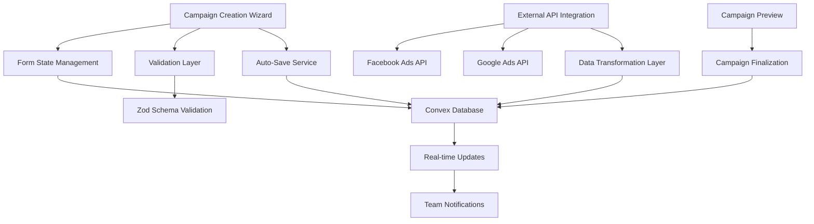

# Campaign Creation Design Document

## Overview

The Campaign Creation feature implements a multi-step wizard interface that guides users through creating comprehensive marketing campaigns. The system supports both native campaign creation and importing from external platforms (Facebook Ads, Google Ads). The design emphasizes user experience with progressive disclosure, real-time validation, auto-save functionality, and seamless integration with the existing Convex authentication system.

## Architecture

### High-Level Architecture



### Data Flow

1. **Native Creation Flow**: User inputs → Form validation → Auto-save drafts → Preview → Final creation
2. **Import Flow**: Platform selection → OAuth authentication → API data fetch → Data transformation → Campaign creation
3. **Draft Management**: Periodic auto-save → Draft retrieval → State restoration

## Components and Interfaces

### Core Components

#### 1. Campaign Creation Wizard (`CampaignWizard`)
- **Purpose**: Main orchestrator component managing wizard flow
- **Props**: 
  - `mode: 'create' | 'import' | 'edit'`
  - `draftId?: string`
  - `onComplete: (campaignId: string) => void`
- **State Management**: Uses React Hook Form with Zod validation
- **Features**: Step navigation, progress tracking, auto-save integration

#### 2. Wizard Steps Components

**Step 1: Campaign Basics (`CampaignBasicsStep`)**
```typescript
interface CampaignBasics {
  name: string;
  description: string;
  startDate: Date;
  endDate: Date;
  budget: number;
  currency: string;
  category: 'pr' | 'content' | 'social' | 'paid' | 'mixed';
  priority: 'low' | 'medium' | 'high';
}
```

**Step 2: Audience & Channels (`AudienceChannelsStep`)**
```typescript
interface AudienceChannels {
  audiences: AudienceSegment[];
  channels: ChannelConfig[];
  budgetAllocation: Record<string, number>;
}

interface AudienceSegment {
  id: string;
  name: string;
  demographics: {
    ageRange: [number, number];
    gender: 'all' | 'male' | 'female' | 'other';
    location: string[];
    interests: string[];
  };
  size: number;
}

interface ChannelConfig {
  type: 'facebook' | 'instagram' | 'twitter' | 'linkedin' | 'email' | 'content' | 'pr';
  enabled: boolean;
  budget: number;
  settings: Record<string, any>;
}
```

**Step 3: KPIs & Metrics (`KPIsStep`)**
```typescript
interface CampaignKPIs {
  primaryKPIs: KPI[];
  customMetrics: CustomMetric[];
  trackingSettings: TrackingConfig;
}

interface KPI {
  type: 'reach' | 'engagement' | 'conversions' | 'brand_awareness' | 'roi';
  target: number;
  timeframe: 'daily' | 'weekly' | 'monthly' | 'campaign';
  weight: number; // Importance weighting
}
```

**Step 4: Team & Access (`TeamAccessStep`)**
```typescript
interface TeamAccess {
  teamMembers: TeamMemberAssignment[];
  clients: ClientAssignment[];
  permissions: CampaignPermissions;
}

interface TeamMemberAssignment {
  userId: string;
  role: 'owner' | 'editor' | 'viewer';
  notifications: boolean;
}
```

#### 3. Import Components

**Platform Selector (`PlatformSelector`)**
- Displays available platforms with OAuth connection status
- Handles platform-specific authentication flows

**Campaign Importer (`CampaignImporter`)**
- Fetches campaigns from connected platforms
- Provides campaign selection interface with preview
- Handles data transformation and mapping

#### 4. Supporting Components

**Auto-Save Manager (`useAutoSave`)**
```typescript
interface AutoSaveHook {
  saveStatus: 'idle' | 'saving' | 'saved' | 'error';
  lastSaved: Date | null;
  forceSave: () => Promise<void>;
}
```

**Draft Manager (`DraftManager`)**
- Lists saved drafts with metadata
- Provides draft deletion and restoration
- Shows draft age and completion status

## Data Models

### Convex Schema Extensions

```typescript
// campaigns table
export const campaigns = defineTable({
  // Basic Information
  name: v.string(),
  description: v.string(),
  status: v.union(v.literal("draft"), v.literal("active"), v.literal("paused"), v.literal("completed")),
  
  // Timeline
  startDate: v.number(), // Unix timestamp
  endDate: v.number(),
  createdAt: v.number(),
  updatedAt: v.number(),
  
  // Budget
  budget: v.number(),
  currency: v.string(),
  budgetAllocation: v.object({
    channels: v.record(v.string(), v.number()),
  }),
  
  // Campaign Details
  category: v.union(v.literal("pr"), v.literal("content"), v.literal("social"), v.literal("paid"), v.literal("mixed")),
  priority: v.union(v.literal("low"), v.literal("medium"), v.literal("high")),
  
  // Audience & Targeting
  audiences: v.array(v.object({
    id: v.string(),
    name: v.string(),
    demographics: v.object({
      ageRange: v.array(v.number()),
      gender: v.string(),
      location: v.array(v.string()),
      interests: v.array(v.string()),
    }),
    estimatedSize: v.optional(v.number()),
  })),
  
  // Channels
  channels: v.array(v.object({
    type: v.string(),
    enabled: v.boolean(),
    budget: v.number(),
    settings: v.any(), // Platform-specific settings
  })),
  
  // KPIs and Metrics
  kpis: v.array(v.object({
    type: v.string(),
    target: v.number(),
    timeframe: v.string(),
    weight: v.number(),
  })),
  
  customMetrics: v.array(v.object({
    name: v.string(),
    description: v.string(),
    target: v.number(),
    unit: v.string(),
  })),
  
  // Access Control
  organizationId: v.id("organizations"),
  createdBy: v.id("users"),
  teamMembers: v.array(v.object({
    userId: v.id("users"),
    role: v.union(v.literal("owner"), v.literal("editor"), v.literal("viewer")),
    assignedAt: v.number(),
  })),
  
  clients: v.array(v.object({
    userId: v.id("users"),
    assignedAt: v.number(),
  })),
  
  // Import Information
  importSource: v.optional(v.object({
    platform: v.string(),
    externalId: v.string(),
    importedAt: v.number(),
    lastSyncAt: v.optional(v.number()),
  })),
})
.index("by_organization", ["organizationId"])
.index("by_creator", ["createdBy"])
.index("by_status", ["status"])
.index("by_import_source", ["importSource.platform", "importSource.externalId"]);

// campaign_drafts table
export const campaignDrafts = defineTable({
  name: v.string(),
  data: v.any(), // Serialized form data
  step: v.number(), // Current wizard step
  createdBy: v.id("users"),
  organizationId: v.id("organizations"),
  createdAt: v.number(),
  updatedAt: v.number(),
  expiresAt: v.number(), // Auto-cleanup old drafts
})
.index("by_user", ["createdBy"])
.index("by_organization", ["organizationId"])
.index("by_expiry", ["expiresAt"]);

// organizations table (if not exists)
export const organizations = defineTable({
  name: v.string(),
  slug: v.string(),
  createdAt: v.number(),
  settings: v.object({
    defaultCurrency: v.string(),
    timezone: v.string(),
  }),
})
.index("by_slug", ["slug"]);
```

### API Integration Models

```typescript
// Facebook Ads API Response Mapping
interface FacebookCampaignData {
  id: string;
  name: string;
  objective: string;
  status: string;
  daily_budget?: string;
  lifetime_budget?: string;
  start_time: string;
  stop_time?: string;
  targeting: {
    age_min?: number;
    age_max?: number;
    genders?: number[];
    geo_locations?: any;
    interests?: any[];
  };
}

// Google Ads API Response Mapping
interface GoogleAdsCampaignData {
  resourceName: string;
  id: string;
  name: string;
  status: string;
  advertisingChannelType: string;
  biddingStrategy: any;
  budget: string;
  startDate: string;
  endDate?: string;
}
```

## Error Handling

### Validation Strategy
- **Client-side**: Zod schemas for immediate feedback
- **Server-side**: Convex function validation for data integrity
- **Cross-field validation**: Custom validators for business rules (e.g., budget allocation totals)

### Error Recovery
- **Auto-save failures**: Retry mechanism with exponential backoff
- **API failures**: Graceful degradation with manual entry fallback
- **Network issues**: Offline draft storage with sync on reconnection

### User Experience
- **Inline validation**: Real-time field validation with clear error messages
- **Step validation**: Prevent progression with incomplete required fields
- **Global error handling**: Toast notifications for system-level errors

## Testing Strategy

### Unit Testing
- **Form validation**: Test all Zod schemas with valid/invalid inputs
- **Component logic**: Test wizard navigation, auto-save, and state management
- **Data transformation**: Test API response mapping functions

### Integration Testing
- **Wizard flow**: End-to-end wizard completion scenarios
- **API integration**: Mock external API responses and test data transformation
- **Database operations**: Test campaign creation, draft management, and queries

### User Acceptance Testing
- **Wizard usability**: Test with different user roles and scenarios
- **Import functionality**: Test with real API connections (staging)
- **Performance**: Test with large datasets and multiple concurrent users

### Test Data
```typescript
// Mock campaign data for testing
export const mockCampaignData = {
  basic: {
    name: "Q1 Brand Awareness Campaign",
    description: "Increase brand visibility in target markets",
    startDate: new Date("2024-01-01"),
    endDate: new Date("2024-03-31"),
    budget: 50000,
    currency: "USD",
    category: "mixed" as const,
    priority: "high" as const,
  },
  // ... additional mock data
};
```

## Performance Considerations

### Optimization Strategies
- **Lazy loading**: Load wizard steps on demand
- **Debounced auto-save**: Prevent excessive database writes
- **Optimistic updates**: Immediate UI feedback with background persistence
- **Caching**: Cache organization data, team members, and platform connections

### Scalability
- **Pagination**: For large campaign lists and team member selection
- **Background processing**: Handle API imports asynchronously
- **Rate limiting**: Respect external API limits with queuing

## Security Considerations

### Data Protection
- **Input sanitization**: Validate and sanitize all user inputs
- **Access control**: Enforce organization-level and role-based permissions
- **API credentials**: Secure storage of OAuth tokens with encryption

### Privacy
- **Data minimization**: Only import necessary campaign data
- **Audit logging**: Track campaign creation and modification events
- **GDPR compliance**: Support data export and deletion requests